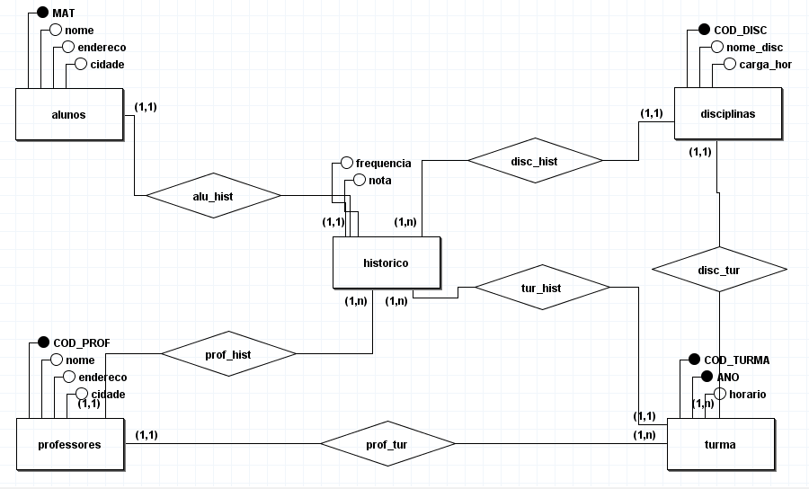
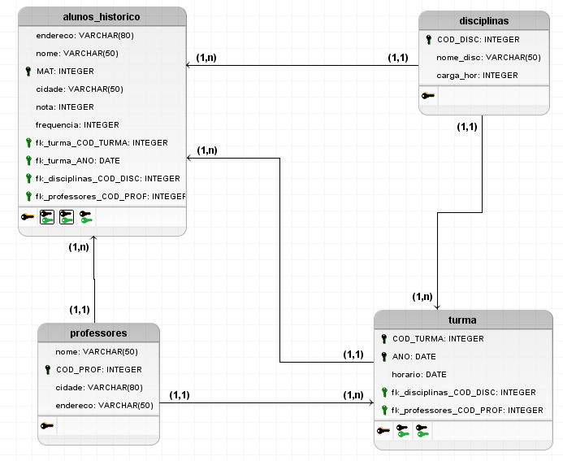

# Modelagem do banco de dados
Modelagem Universidade.

Repositório para modelagem do banco de dados. 

# Mapa Conceitual

## 

# Mapa Lógico

## Descrição das tabelas do modelo

------------------------------------------------------------------------------------------------------------------------------------------------

## _Tabela Alunos_Historico_
A tabela _alunos_historico_ é a base de dados para manter alguns dados pessoais dos alunos da universidade e algumas informações sobre como a universidade administra seu historico. Nela possuímos os atributos/colunas:

•endereco: endereço do aluno

•nome: nome do aluno

•MAT: chave primária da tabela

•cidade: cidade do aluno

•nota: nota do aluno guardada no historico

•frequencia: frequencia do aluno guardada no historico

•fk_turma_COD_TURMA: chave estrangeira que faz referência a tabela _turma_

•fk_turma_ANO: chave estrangeira que faz referência a tabela _turma_

•fk_disciplina_COD_DISC: chave estrangeira que faz referência a tabela _disciplina_

•fk_professores_COD_PROF: chave estrangeira que faz referência a tabela _referência_

------------------------------------------------------------------------------------------------------------------------------------------------

## _Tabela Professores_
A tabela _professores_, assim como na tabela _alunos_historico_, será a base de dados para manter alguns dados pessoais dos professores da universidade. Nela possuímos os atributos/colunas:

•nome: nome do professor

•COD_PROF: chave primária da tabela

•cidade: cidade onde se encontra o professor

•endereco: endereço atual em que reside o professor

------------------------------------------------------------------------------------------------------------------------------------------------

## _Tabela Turma_
Na tabela _turma_ é mostrado algumas informações armazenadas das turmas da faculdade. Nela possuímos os atributos/colunas:

•COD_TURMA: chave primária da tabela

•ANO: chave primária da tabela

•horário: calendário de aulas 

•fk_disciplinas_COD_DISC: chave estrangeira que faz referência a tabela _disciplinas_

•fk_professores_COD_PROF: chave estrangeira que faz referência a tabela _professores_

------------------------------------------------------------------------------------------------------------------------------------------------

## _Tabela Disciplinas_
A tabela _disciplinas_ trás informações armazenadas sobre horarios e nomes das disciplinas apresentadas na universidade.

•COD_DISC: chave primária da tabela

•nome_disc: nomes das disciplinas

•carga_hor: carga horaria de disciplinas